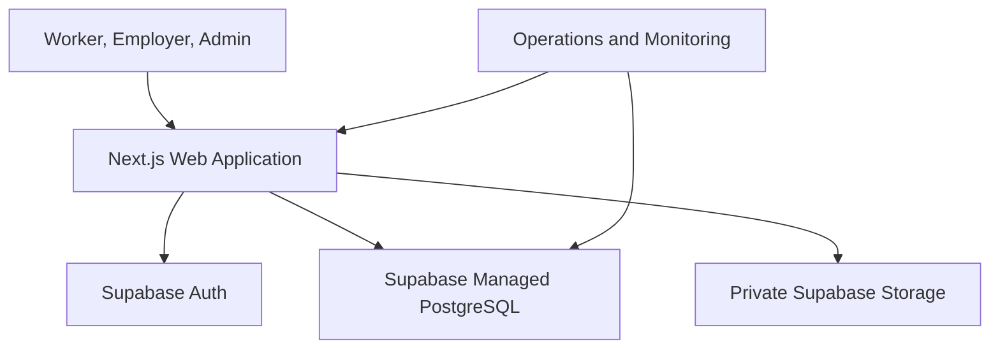

# Rintara System Architecture

> **Version:** 3.1
>
> **Date:** July 19, 2026
>
> **Status:** MVP technical baseline
>
> **Product scope:** `docs/product/PRD.md`
>
> **Domain behavior:** `docs/product/BUSINESS_RULES.md`

## 1. Architecture Goals

The architecture must make Rintara's golden path reliable without creating operational complexity the MVP does not need.

Primary goals:

- ship a coherent, testable product quickly;
- protect authorization and private addresses at the server boundary;
- preserve lifecycle invariants under concurrent requests;
- scale web traffic horizontally without redesigning the product;
- keep the database as the durable source of truth;
- remain understandable to the full team during technical review.

Non-goals include microservices, event streaming, realtime chat, payment infrastructure, continuous location tracking, and multi-region active-active deployment.

## 2. Baseline Stack

| Layer | Decision |
| --- | --- |
| Web application | Next.js App Router, React, TypeScript |
| Styling | Tailwind CSS and accessible UI primitives already approved by the repository |
| Forms and validation | React Hook Form with Zod, or an equivalent established repository pattern |
| Application server | Next.js Server Components, Server Actions, and limited Route Handlers |
| Database | Supabase Managed PostgreSQL through standard PostgreSQL connections |
| Data access | Drizzle ORM plus explicit SQL where transaction or query-plan control is needed |
| Authentication | Supabase Auth with cookie-based Next.js SSR; no custom password or session implementation |
| Private completion media | Supabase Storage private bucket behind a server-only adapter, as accepted in ADR-013 |
| Deployment | Vercel; `main` is the production branch |
| Testing | Unit/domain tests, PostgreSQL integration tests, and manual release smoke testing |

ADR-011, ADR-012, and ADR-013 select Vercel, Supabase Managed PostgreSQL,
Supabase Auth, and a narrowly bounded private Supabase Storage path for work
completion evidence. Business state remains in PostgreSQL; provider-specific
authentication and binary-storage code stays behind infrastructure adapters.

## 3. System Context



Rintara is a modular monolith:

- one deployable Next.js application;
- one PostgreSQL database;
- one authentication integration;
- one private object-storage bucket for normalized completion evidence;
- no internal network boundary between UI and domain services;
- clear code-level boundaries so modules can be extracted later only if evidence justifies it.

## 4. Runtime Responsibilities

### 4.1 Browser

The browser handles navigation, accessible interactions, form state, optimistic affordances only where safe, and rendering of already-authorized data. It is untrusted.

The browser must not decide:

- user identity, role, or account status;
- resource ownership;
- First Opportunity eligibility;
- Wage Guideline compliance;
- lifecycle transitions;
- proof or credit issuance; or
- whether a private address may be returned.

### 4.2 Next.js presentation layer

Server and Client Components handle layouts, page composition, metadata, loading and error boundaries, input collection, and safe data presentation.

Presentation code calls named queries or domain commands. It does not execute free-form status updates or contain duplicate business rules.

### 4.3 Domain layer

The server domain layer owns:

- session and active-account checks;
- role, ownership, and relationship authorization;
- input normalization and validation;
- eligibility calculations;
- state transition validation;
- transaction orchestration;
- idempotency;
- notification creation; and
- audit creation.

### 4.4 Data-access layer

The data-access layer owns parameterized queries, row projections, transactions, row locks or conditional writes, pagination, and mapping database errors to typed domain errors.

### 4.5 PostgreSQL

PostgreSQL owns durable data, referential integrity, uniqueness, check constraints, indexes, and the final concurrency safety boundary.

Application validation improves error quality; it does not replace database constraints.

## 5. Repository Boundaries

Rintara uses the Next.js App Router with application directories at the
repository root. The optional `src/` wrapper is intentionally not used. Route
entry points stay in `app/`; there is no application-level `App.tsx` in the
App Router convention.

```text
app/                      # routes, layouts, pages, loading/error boundaries
components/
  ui/                     # reusable presentation primitives
  rintara/                # shared cross-feature product presentation
features/
  auth/                   # authentication presentation and client state
  onboarding/             # worker/employer onboarding presentation
  dashboard/              # shared role-dashboard presentation
server/
  auth/                   # session and authorization helpers
  db/                     # client, schema, migrations, query helpers
  domain/                 # commands, policies, transactions
  queries/                # authorized read models and DTO projections
  validation/             # shared server schemas
  observability/          # safe logs and request correlation
lib/                      # framework-neutral utilities
tests/
  unit/
  integration/
```

Rules:

- Server-only modules must use the repository's server-only guard.
- Route modules should remain thin and compose feature or shared components.
- Feature-specific presentation belongs under `features/<feature>`; only
  genuinely cross-feature presentation belongs under `components/`.
- React components never import database schema or client instances.
- Domain commands do not import React or route modules.
- Features may share domain types through explicit public modules, not deep cross-feature imports.

## 6. Request and Mutation Flow

### Query flow

```text
Page or Server Component
-> authorized query function
-> session/relationship check when private
-> database projection
-> safe DTO
-> render
```

### Mutation flow

```text
Form or client interaction
-> Server Action or Route Handler
-> parse and validate input
-> authenticate and authorize
-> execute named domain command
-> transaction and constraints
-> safe result/error
-> revalidate affected views
```

Never accept `userId`, `role`, `ownerId`, `verified`, `creditAmount`, or arbitrary `status` when the server can derive it.

## 7. Transaction Boundaries

The following operations require database transactions:

### `acceptApplication`

- validate employer and job ownership;
- protect the job from concurrent acceptance;
- require a submitted application and server time strictly before the
  selection cutoff at `startsAt - 24 hours`;
- re-evaluate First Opportunity eligibility;
- accept one application and reject the others;
- mark the job filled;
- create one agreement snapshot;
- write notifications and audit record.

### `confirmAgreement`

- lock the agreement through the caller's party relationship;
- return the stored state without writes when that party already confirmed;
- set only the caller's confirmation timestamp;
- on the second confirmation, activate the agreement and create the unique scheduled work session;
- write safe notifications and audit metadata in the same transaction.

### `verifyCompletion`

- protect agreement/session/job from duplicate completion;
- verify no active report blocks the workflow;
- mark session, agreement, and job complete;
- create one Work Proof;
- conditionally issue one Opportunity Credit;
- write notifications and audit record.

### `redeemOpportunityCredit`

- claim an eligible credit exactly once;
- validate the published target job and ownership;
- reject overlapping active boost;
- create the 24-hour boost;
- write notification and audit record.

Transactions must be short. Do not call external authentication, messaging, storage, analytics, or other network services while holding locks.

### Work completion evidence upload

Image validation and normalization happen before object upload. Each upload
uses a new random private path. After upload, a short PostgreSQL transaction
locks the work session, rechecks that it is still `checked_in`, and inserts or
replaces the unique metadata pointer. A failed transaction attempts to delete
the newly uploaded object. A successful replacement attempts to delete the
previous object after commit. `checkOut` locks the same work-session row and
requires the metadata record, so upload/replacement cannot race checkout.

## 8. Read Models and Privacy Boundaries

Use distinct projections instead of returning table-shaped objects everywhere.

| Projection | Intended audience | Must exclude |
| --- | --- | --- |
| Public job card | Anyone | Full address, contacts, applicant data, moderation fields |
| Public job detail | Anyone | Full address, contacts, internal wage source notes, applicant data |
| Worker application detail | Applicant | Other applicants, employer private administration data |
| Employer applicant view | Owning employer | Worker data unrelated to the application |
| Agreement detail | Two parties/admin | Data unrelated to the agreement |
| Work completion photo | Related worker, related employer, authorized admin | Storage path, service credential, unrelated sessions, public caches |
| Passport owner view | Worker | Internal audit/moderation metadata |
| Passport applicant view | Owning employer | Private worker data beyond verified work context |

Full work addresses live in `job_private_details` and appear only in authorized agreement projections.

## 9. Rendering and Caching

- Public marketing content may be statically rendered or cached.
- Public job discovery may use short revalidation and tag-based invalidation after publish, cancellation, expiry, completion, or boost changes.
- Personalized dashboards, agreements, applicant lists, notifications, reports, and admin pages must not use shared public caches.
- Authorization must run before any private data enters a cacheable response.
- Cache correctness is more important than avoiding a database read for the MVP.

### 9.1 Client rendering and motion budget

The interaction behavior and accessibility requirements remain authoritative in `docs/design/UI_UX_DESIGN.md`. The shipped runtime follows these guardrails:

- Render public pages, authentication, onboarding, and dashboards as normal semantic markup. Use Server Components by default and add `"use client"` only for small islands that require browser state or APIs, including authentication controls, navigation, forms, sheets, and dialogs. The `/sign-in` and `/register` Server Pages normalize their own query input inside one shared route-group provider. That provider retains only ephemeral form drafts and validated navigation state; each route owns its visual shell, while credential mutations remain Server Actions. `/register` may reuse the server-rendered compact `AuthHeader`, but it must not wrap its route-owned canvas in `AuthVisualFrame` or `AuthPanel`.
- Load the approved homepage documentary asset through `next/image` with
  reserved responsive dimensions and appropriate `sizes`:
  `public/visuals/rintara-local-work-v2.webp`. `/register` renders the committed
  local `public/visuals/rintara-register-curves.svg` as a route-owned,
  non-interactive Mint, Chalk, and Forest ellipse layer. Sign-in, recovery, and
  password reset remain image-free. Neither asset may become a gallery,
  autoplay surface, or client-rendered background system.
- The public header may use one passive scroll listener throttled through a
  single scheduled `requestAnimationFrame` to interpolate its contained,
  lightly frosted starting layout into a compact translucent floating surface
  across a bounded scroll distance. One bounded `backdrop-filter` is allowed
  on this header surface. It must not update React state per scroll event, run
  a continuous animation-frame loop, or observe each content section.
- The public profile control reads only the private, no-store presentation DTO
  from `/auth/status?detail=account`. That DTO is derived from the
  proxy-verified session and allowlists account state, active role, and the
  signed-in account's own display name. It is navigation presentation only;
  every private route and operation still performs independent server-side
  role and relationship authorization.
- Keep interaction motion finite and state-based. Prefer short transform,
  color, border, opacity, height, width, radius, padding, and shadow
  transitions. The single 200ms CSS registration-entry reveal and finite role
  interaction feedback are allowed; reduced motion makes them immediate. Do
  not create other automatic entrances, ambient loops, or reveal choreography.
- Do not mount decorative Canvas or WebGL renderers, particle fields, pointer-tracking or mouse-following effects, automatic scroll reveal, or fallback CSS particle layers.
- `prefers-reduced-motion: reduce` collapses nonessential transitions and disables smooth scrolling while keeping every route, form, navigation control, image, and status immediately available. No appearance or theme-transition runtime is shipped.

## 10. Scalability Strategy

### MVP baseline

- stateless Next.js instances;
- PostgreSQL connection pooling sized for the deployment platform;
- cursor or stable page pagination for every growing list;
- indexes verified against critical queries;
- short transactions and bounded result sets;
- no global mutable memory for sessions, credits, or counters;
- asynchronous/non-critical work deferred until after the core transaction when needed.

### Scale when evidence requires it

1. Optimize slow queries and remove N+1 access.
2. Add or adjust indexes using query plans and production-like data.
3. Cache anonymous discovery results with safe invalidation.
4. Move scheduled and non-critical notification work to a durable job mechanism.
5. Add read replicas only for measured read pressure and after resolving consistency expectations.
6. Partition or archive large audit/notification tables only after real growth warrants it.
7. Extract a service only when independent scaling, ownership, or reliability requirements justify the operational cost.

Next.js plus PostgreSQL can scale well beyond the competition MVP. The first likely constraints are inefficient queries, excess database connections, unbounded lists, and missing cache discipline—not the absence of microservices.

## 11. Security Architecture

### Authentication and authorization

- Validate the session in every private query and command.
- Load current role and status from PostgreSQL or trusted synchronized auth data.
- Enforce role plus resource ownership or party relationship.
- Route/layout protection is a UX layer, not a security boundary.
- Include negative authorization tests for cross-account resource IDs.

### Web controls

- Validate with server-side schemas.
- Use parameterized queries.
- Follow the auth provider's CSRF protection model.
- Escape user content; raw HTML requires an approved sanitizer.
- Rate-limit abuse-prone commands.
- Use secure, HTTP-only, same-site cookies as supported by the auth solution.
- Keep production secrets in deployment configuration, never source control or client bundles.

### Data minimization

Do not collect government IDs, bank accounts, card data, continuous GPS, full birth dates, or private chat in the MVP. Do not include full addresses, tokens, plaintext check-in codes, or private moderator notes in logs.

## 12. Reliability and Failure Handling

- Domain errors are typed and safe for display or mapping.
- Unexpected errors receive a request correlation ID and safe structured log.
- Database constraint failures map to stable conflict errors, not raw SQL messages.
- Notifications are stored in PostgreSQL; their creation is transactional where the notification represents a committed critical state.
- Client retries must not duplicate completion or redemption.
- Time comparisons use server time and UTC storage.

## 13. Observability

Minimum signals:

- request or command name;
- duration and result class;
- correlation ID;
- unexpected error code;
- slow database query signal;
- failed authorization count without personal data;
- deployment health.

Never log passwords, session tokens, check-in codes, full addresses, application notes, or unrestricted request bodies.

## 14. Deployment Environments

| Environment | Purpose | Data rule |
| --- | --- | --- |
| Local | Development and tests | Local or isolated development database |
| Preview | Review and acceptance | Synthetic data only; separate credentials |
| Demo | Live rehearsal and presentation | Dedicated Supabase project, synthetic accounts created through normal application flows |
| Production | Public MVP | Managed backups, least-privilege credentials, no seed/reset command |

Required configuration categories include database connection, authentication secrets and callbacks, application base URL, rate-limit configuration if used, and observability configuration. Environment names are documented in the repository README without secret values.

Database migrations run as a controlled deployment step. Application instances must not race to run migrations on startup.
Local/test seeds are restricted to loopback PostgreSQL. The repository seed
command cannot reset a preview, demo, or production database. Remote demo data
is prepared through normal registration, onboarding, and job-management flows.

## 15. Testing Architecture

- Domain policy tests use deterministic clocks and fixtures.
- Integration tests run against real PostgreSQL behavior, not an in-memory substitute for transaction-sensitive paths.
- Concurrency tests cover acceptance, completion, and credit redemption.
- Query tests verify public/private projections.
- Manual release smoke testing rehearses the golden path and required authorization scenarios.
- Local seed data creates synthetic role fixtures, active reference data, and
  two visible future-deadline jobs. The reset verifies discoverability before
  committing.
  commit; workflow state is created by the rehearsed golden path.

## 16. Architecture Decision Guardrails

The following changes require an explicit architecture decision and PRD impact review:

- adding a second database or cache as a source of truth;
- introducing microservices, queues, or event streaming;
- replacing PostgreSQL or Next.js;
- adding payment or chat infrastructure;
- storing sensitive identity or location data;
- adding public APIs for third-party consumers; or
- weakening transaction or authorization boundaries for speed.
