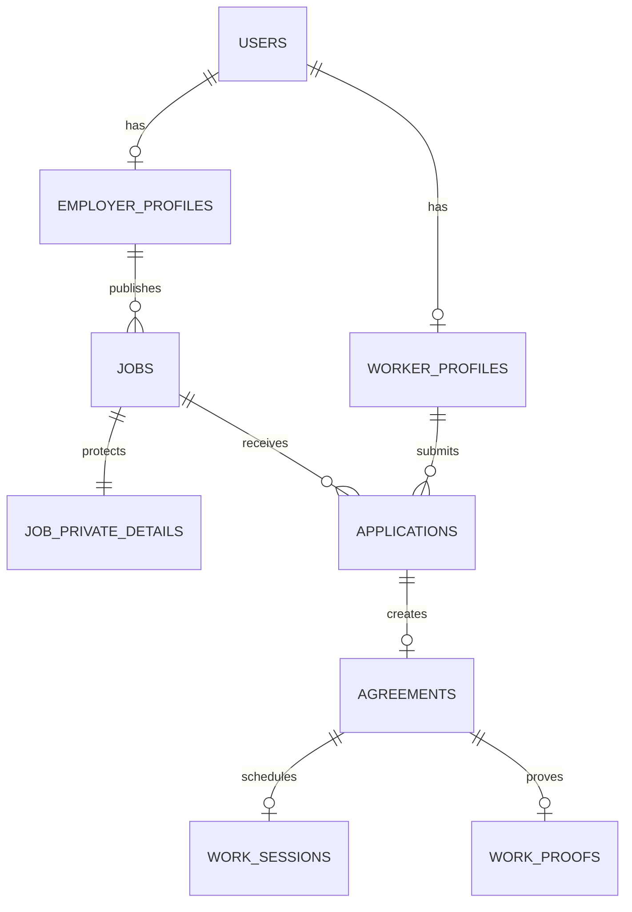
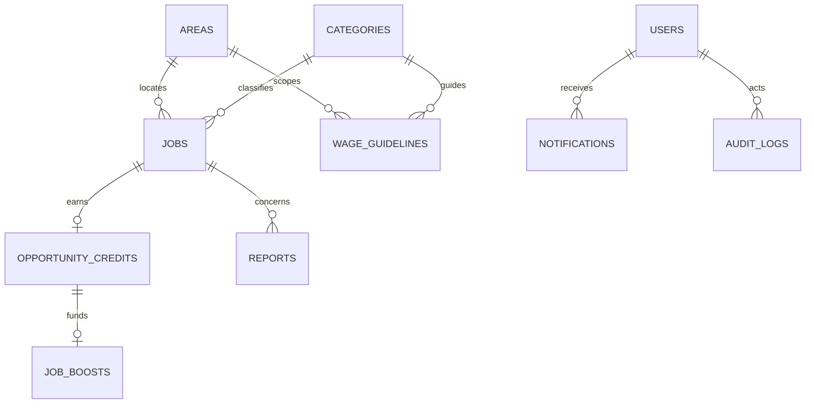

# Rintara PostgreSQL Database Design

> **Version:** 3.0  
> **Date:** July 18, 2026  
> **Status:** MVP logical schema baseline  
> **Domain authority:** `docs/product/BUSINESS_RULES.md`

## 1. Design Principles

- PostgreSQL is the source of truth for business state.
- Use UUID primary keys and `timestamptz` timestamps stored in UTC.
- Store Indonesian rupiah as positive `bigint`, never floating-point.
- Enforce critical invariants with foreign keys, unique indexes, check constraints, and transactions.
- Separate public job data from the private full address.
- Prefer immutable snapshots for accepted terms and Work Proof.
- Use logical deletion/status changes for lifecycle evidence.
- Keep user-facing reads on explicit projections rather than exposing raw rows.

This is a logical design. Migration syntax may use PostgreSQL enums or constrained text according to the established repository convention, but the allowed values and invariants remain normative.

## 2. Core Entity Relationship Diagram





## 3. Enumerated Values

| Domain | Values |
| --- | --- |
| `user_role` | `worker`, `employer`, `admin` |
| `account_status` | `active`, `suspended`, `deleted` |
| `employer_type` | `individual`, `business`, `community` |
| `area_level` | `province`, `city_regency`, `district` |
| `risk_level` | `low`, `restricted` |
| `wage_unit` | `hour`, `day`, `job` |
| `wage_status` | `compliant`, `below`, `unavailable` |
| `job_status` | `draft`, `published`, `filled`, `in_progress`, `completed`, `expired`, `cancelled` |
| `job_visibility` | `visible`, `hidden` |
| `application_status` | `submitted`, `accepted`, `rejected`, `withdrawn` |
| `agreement_status` | `pending_confirmation`, `active`, `completed`, `cancelled` |
| `work_session_status` | `scheduled`, `checked_in`, `checked_out`, `verified` |
| `proof_status` | `verified`, `revoked` |
| `credit_status` | `earned`, `redeemed`, `expired`, `revoked` |
| `boost_status` | `active`, `ended`, `revoked` |
| `report_status` | `open`, `reviewing`, `resolved`, `rejected` |
| `report_reason` | `suspicious_job`, `terms_mismatch`, `absence`, `unsafe_behavior`, `spam`, `other` |

## 4. Identity and Profiles

### `users`

| Column | Type | Rules |
| --- | --- | --- |
| `id` | uuid | Primary key |
| `auth_subject` | text | Unique, immutable external auth identifier |
| `role` | user_role | Required |
| `status` | account_status | Required, default `active` |
| `created_at` | timestamptz | Required |
| `updated_at` | timestamptz | Required |
| `deleted_at` | timestamptz nullable | Set only for logical deletion |

Email, phone, credential, and session tables remain owned by the selected authentication solution unless the integration explicitly requires synchronized non-secret fields.

### `worker_profiles`

| Column | Type | Rules |
| --- | --- | --- |
| `user_id` | uuid | Primary key, FK `users.id` |
| `display_name` | text | Required, length bounded |
| `area_id` | uuid | FK `areas.id` |
| `bio` | text nullable | Length bounded |
| `availability_note` | text nullable | Length bounded |
| `created_at`, `updated_at` | timestamptz | Required |

### `employer_profiles`

| Column | Type | Rules |
| --- | --- | --- |
| `user_id` | uuid | Primary key, FK `users.id` |
| `display_name` | text | Required, length bounded |
| `employer_type` | employer_type | Required |
| `area_id` | uuid | FK `areas.id` |
| `description` | text nullable | Length bounded |
| `created_at`, `updated_at` | timestamptz | Required |

Do not persist a mutable credit balance or badge boolean. Derive them from `opportunity_credits`.

## 5. Reference Data

### `areas`

- `id` uuid primary key
- `parent_id` nullable FK to `areas.id`
- `level` area_level
- `code` text unique
- `name` text
- `is_active` boolean

### `categories`

- `id` uuid primary key
- `slug` text unique
- `name` text
- `risk_level` risk_level
- `first_opportunity_allowed` boolean
- `is_active` boolean

### `worker_interests`

- `worker_id` FK `worker_profiles.user_id`
- `category_id` FK `categories.id`
- primary key `(worker_id, category_id)`

Interests are self-declared and never treated as verified experience.

### `wage_guidelines`

| Column | Type | Rules |
| --- | --- | --- |
| `id` | uuid | Primary key |
| `area_id` | uuid | FK `areas.id` |
| `category_id` | uuid | FK `categories.id` |
| `unit` | wage_unit | Required |
| `minimum_amount` | bigint | `> 0` |
| `recommended_amount` | bigint | `>= minimum_amount` |
| `source_label` | text | Required |
| `source_url` | text nullable | Validated URL when present |
| `is_simulated` | boolean | Required |
| `effective_from` | date | Required |
| `effective_to` | date nullable | Must be after `effective_from` |
| `is_active` | boolean | Required |
| `created_by` | uuid | FK `users.id` |
| `created_at`, `updated_at` | timestamptz | Required |

Prevent overlapping active guidelines for the same area, category, and unit through a migration-level exclusion strategy or an admin transaction check plus a supporting index.

## 6. Jobs and Applications

### `jobs`

| Column | Type | Rules |
| --- | --- | --- |
| `id` | uuid | Primary key |
| `employer_id` | uuid | FK `employer_profiles.user_id`, restricted delete |
| `category_id` | uuid | FK `categories.id` |
| `area_id` | uuid | FK `areas.id` |
| `title` | text | Required, bounded |
| `description` | text | Required, bounded |
| `task_scope` | text | Required, bounded |
| `public_location_label` | text | General area only |
| `starts_at` | timestamptz | Required |
| `estimated_minutes` | integer | `> 0` and bounded |
| `wage_amount` | bigint | `> 0` |
| `wage_unit` | wage_unit | Required |
| `wage_status` | wage_status | Calculated at publication |
| `payment_method` | text | Outside-platform method, bounded |
| `payment_timing` | text | Bounded |
| `tools_provided` | text nullable | Bounded |
| `tools_required` | text nullable | Bounded |
| `risk_level` | risk_level | Required |
| `is_first_opportunity` | boolean | Required, default false |
| `application_deadline` | timestamptz | Strictly before `starts_at - interval '24 hours'` |
| `status` | job_status | Required, default `draft` |
| `visibility` | job_visibility | Required, default `visible` |
| `published_at` | timestamptz nullable | Set once on publish |
| `completed_at` | timestamptz nullable | Set on verified completion |
| `cancelled_at` | timestamptz nullable | Set on cancellation |
| `cancellation_reason` | text nullable | Required when cancelled |
| `hidden_at` | timestamptz nullable | Admin moderation timestamp |
| `hidden_by` | uuid nullable | FK `users.id` |
| `hidden_reason` | text nullable | Required while hidden |
| `created_at`, `updated_at` | timestamptz | Required |

Published terms are immutable at the domain layer. Database permissions or triggers may reinforce this later, but the MVP must not expose a published-job update command.

### `job_private_details`

| Column | Type | Rules |
| --- | --- | --- |
| `job_id` | uuid | Primary key, FK `jobs.id`, restricted delete |
| `full_address` | text | Required, encrypted at rest through provider storage controls |
| `arrival_instructions` | text nullable | Bounded and private |
| `created_at`, `updated_at` | timestamptz | Required |

Public query modules must not join this table.

### `applications`

| Column | Type | Rules |
| --- | --- | --- |
| `id` | uuid | Primary key |
| `job_id` | uuid | FK `jobs.id`, restricted delete |
| `worker_id` | uuid | FK `worker_profiles.user_id`, restricted delete |
| `note` | text | Required, bounded |
| `first_opportunity_eligible_at_submission` | boolean | Server calculated |
| `status` | application_status | Default `submitted` |
| `submitted_at` | timestamptz | Required |
| `decided_at` | timestamptz nullable | Set for accepted/rejected |
| `withdrawn_at` | timestamptz nullable | Set for withdrawal |

Constraints and indexes:

```sql
UNIQUE (job_id, worker_id)
```

```sql
CREATE UNIQUE INDEX applications_one_accepted_per_job
ON applications (job_id)
WHERE status = 'accepted';
```

## 7. Agreements, Attendance, and Proof

### `agreements`

| Column | Type | Rules |
| --- | --- | --- |
| `id` | uuid | Primary key |
| `application_id` | uuid | Unique FK `applications.id` |
| `job_id` | uuid | Unique FK `jobs.id` |
| `worker_id` | uuid | FK `users.id` |
| `employer_id` | uuid | FK `users.id` |
| `terms_snapshot` | jsonb | Required, schema-versioned and immutable |
| `snapshot_version` | smallint | Required |
| `is_first_opportunity` | boolean | Captured at acceptance |
| `wage_status` | wage_status | Captured at acceptance |
| `worker_confirmed_at` | timestamptz nullable | Independent confirmation |
| `employer_confirmed_at` | timestamptz nullable | Independent confirmation |
| `status` | agreement_status | Default `pending_confirmation` |
| `cancelled_at` | timestamptz nullable | Administrative cancellation |
| `cancellation_reason` | text nullable | Required when cancelled |
| `created_at`, `updated_at` | timestamptz | Required |

The snapshot contains the full address and all accepted terms. It is returned only through an authorized agreement DTO.

### `work_sessions`

| Column | Type | Rules |
| --- | --- | --- |
| `id` | uuid | Primary key |
| `agreement_id` | uuid | Unique FK `agreements.id` |
| `status` | work_session_status | Default `scheduled` |
| `check_in_code_hash` | text nullable | Never plaintext |
| `check_in_code_expires_at` | timestamptz nullable | Required with hash |
| `check_in_failed_attempts` | smallint | Default 0, between 0 and 5 |
| `check_in_code_used_at` | timestamptz nullable | Single-use marker |
| `checked_in_at` | timestamptz nullable | Server timestamp |
| `checked_out_at` | timestamptz nullable | Server timestamp |
| `completion_note` | text nullable | Bounded |
| `verified_at` | timestamptz nullable | Server timestamp |
| `verified_by` | uuid nullable | FK `users.id` |
| `created_at`, `updated_at` | timestamptz | Required |

### `work_proofs`

| Column | Type | Rules |
| --- | --- | --- |
| `id` | uuid | Primary key |
| `agreement_id` | uuid | Unique FK `agreements.id` |
| `worker_id` | uuid | FK `users.id` |
| `employer_id` | uuid | FK `users.id` |
| `category_id` | uuid | FK `categories.id` |
| `job_title_snapshot` | text | Required |
| `area_label_snapshot` | text | General area only |
| `wage_amount_snapshot` | bigint | `> 0` |
| `wage_unit_snapshot` | wage_unit | Required |
| `started_at` | timestamptz | Required |
| `completed_at` | timestamptz | Required |
| `verification_status` | proof_status | Default `verified` |
| `issued_at` | timestamptz | Required |
| `revoked_at` | timestamptz nullable | Admin action |
| `revoked_by` | uuid nullable | FK `users.id` |
| `revocation_reason` | text nullable | Required when revoked |

Rintara Passport is an authorized query over this table. There is no editable `passports` table.

## 8. Rewards

### `opportunity_credits`

| Column | Type | Rules |
| --- | --- | --- |
| `id` | uuid | Primary key |
| `employer_id` | uuid | FK `users.id` |
| `source_job_id` | uuid | Unique FK `jobs.id` |
| `status` | credit_status | Default `earned` |
| `earned_at` | timestamptz | Required |
| `expires_at` | timestamptz nullable | Null for demo default |
| `redeemed_at` | timestamptz nullable | Set on redemption |
| `target_job_id` | uuid nullable | FK `jobs.id` |
| `revoked_at` | timestamptz nullable | Admin action |
| `revoked_by` | uuid nullable | FK `users.id` |
| `revocation_reason` | text nullable | Required when revoked |

The active balance is calculated from owned `earned` credits whose expiry is null or in the future. The maximum balance of three is enforced inside the completion transaction while locking an employer-scoped row or equivalent safe serialization point.

Authorized moderation may transition an `earned` or `redeemed` credit to `revoked`. A revoked redeemed credit retains its redemption metadata, and any related active boost is deactivated consistently.

### `job_boosts`

| Column | Type | Rules |
| --- | --- | --- |
| `id` | uuid | Primary key |
| `credit_id` | uuid | Unique FK `opportunity_credits.id` |
| `job_id` | uuid | FK `jobs.id` |
| `starts_at` | timestamptz | Required |
| `ends_at` | timestamptz | Exactly 24 hours after start |
| `status` | boost_status | Default `active` |
| `revoked_at` | timestamptz nullable | Admin action |
| `created_at` | timestamptz | Required |

An index on `(job_id, status, ends_at)` supports active-boost checks. Transactional validation prevents overlapping boosts for one job.

## 9. Reports, Notifications, Audit, and Idempotency

### `reports`

- `id` uuid primary key
- `reporter_id` FK `users.id`
- `reason` report_reason
- `description` text nullable, bounded
- `job_id` nullable FK `jobs.id`
- `agreement_id` nullable FK `agreements.id`
- `reported_user_id` nullable FK `users.id`
- `status` report_status default `open`
- `moderator_id` nullable FK `users.id`
- `moderator_note` text nullable, private
- `created_at`, `updated_at`, `resolved_at` timestamps

Require at least one target column. Domain validation verifies the reporter's relationship and determines which active reports block a workflow.

### `notifications`

- `id` uuid primary key
- `recipient_id` FK `users.id`
- `type` text from a controlled application enum
- `title` text
- `body` text
- `entity_type` text nullable
- `entity_id` uuid nullable
- `read_at` timestamptz nullable
- `created_at` timestamptz

Notification copy must not contain full addresses, codes, tokens, or private moderator notes.

### `audit_logs`

- `id` uuid primary key
- `actor_id` nullable FK `users.id`
- `action` text from a controlled application enum
- `entity_type` text
- `entity_id` uuid
- `request_id` text
- `metadata` jsonb with an allowlisted schema
- `created_at` timestamptz

Audit rows are append-only through application roles.

### `idempotency_keys`

- `id` uuid primary key
- `actor_id` FK `users.id`
- `operation` text
- `key` text
- `request_hash` text
- `response_payload` jsonb nullable
- `completed_at` timestamptz nullable
- `expires_at` timestamptz
- unique `(actor_id, operation, key)`

Reuse with a different request hash is rejected. Response payloads contain safe operation results only.

## 10. Required Indexes

| Query | Index strategy |
| --- | --- |
| Public job discovery | `(status, visibility, application_deadline, is_first_opportunity, area_id, category_id, published_at desc)` plus targeted indexes based on query plans |
| Unfilled job expiry | `(status, starts_at)` |
| Wage lookup | `(area_id, category_id, unit, is_active, effective_from, effective_to)` |
| Job applicants | `(job_id, status, submitted_at)` |
| Worker applications | `(worker_id, status, submitted_at desc)` |
| Beginner eligibility | `(worker_id, category_id, verification_status)` |
| Employer active credits | `(employer_id, status, expires_at)` |
| Active boosts | `(job_id, status, starts_at, ends_at)` |
| Unread notifications | `(recipient_id, read_at, created_at desc)` |
| Admin report queue | `(status, created_at)` |
| Audit lookup | `(entity_type, entity_id, created_at desc)` and `(actor_id, created_at desc)` |

Verify critical indexes with `EXPLAIN (ANALYZE, BUFFERS)` against production-like seed volume before making scalability claims.

## 11. Public and Private Projections

Create query-layer projections or SQL views with explicit columns:

- `public_job_cards`: visible published jobs with a future deadline; general area, wage, category, deadline, First Opportunity, active boost; no private join.
- `public_job_details`: public terms only; no address or applicant data.
- `worker_passport_entries`: non-revoked proof fields appropriate to the current viewer.
- `employer_credit_summary`: derived active count and lifetime qualifying count.
- `admin_report_queue`: report metadata with private moderator access only.

Never serialize complete ORM rows into public responses.

## 12. Transaction Design

### Accept application

1. Begin transaction.
2. Lock the job row or perform a conditional `published -> filled` update.
3. Validate employer ownership and the selected submitted application, and
   require server time to be strictly earlier than
   `starts_at - interval '24 hours'`.
4. Re-query category eligibility.
5. Mark selected application accepted and remaining submitted applications rejected.
6. Create the unique agreement snapshot.
7. Write notifications and audit record.
8. Commit.

`application_deadline` is not an acceptance cutoff. It closes public discovery
and new submissions while the job remains available to its owner for selection.

### Expire unfilled job

1. Lock an unfilled `published` job at or after
   `starts_at - interval '24 hours'`.
2. Transition the job to `expired`.
3. Reject its remaining submitted applications.
4. Write worker notifications and audit history.
5. Commit all state and side effects atomically.

### Confirm agreement

1. Begin transaction and lock the agreement row through the caller's party relationship.
2. Return the stored state without writes when that party already confirmed.
3. Require `pending_confirmation` and set only the caller's confirmation timestamp.
4. When the other timestamp already exists, transition to `active` in the same update and insert the unique scheduled work session.
5. Write address-free notifications and an append-only confirmation audit; record activation in allowlisted audit metadata.
6. Commit.

The row lock serializes concurrent confirmations. The unique
`work_sessions.agreement_id` constraint remains the final boundary against a
duplicate session.

### Verify completion

1. Begin transaction and acquire workflow protection.
2. Return stored successful result if already completed.
3. Validate owner, states, and absence of active reports.
4. Update session, agreement, and job.
5. Insert unique Work Proof.
6. If reward criteria pass and active credit count is below three, insert unique credit; otherwise audit skip reason.
7. Write notifications and audit record.
8. Commit.

### Redeem credit

1. Begin transaction and claim idempotency key.
2. Lock credit and validate employer/job ownership and states.
3. Validate no overlapping active boost.
4. Mark credit redeemed and insert unique boost ending in 24 hours.
5. Store safe idempotent result, notification, and audit record.
6. Commit.

## 13. Deletion and Retention

- Restrict or soft-delete users referenced by business records.
- Do not cascade-delete jobs into applications, agreements, proof, credits, reports, or audit.
- Draft jobs with no dependent records MAY be physically deleted only if team policy explicitly allows it.
- Revocation and cancellation retain the original record and reason.
- Define production retention periods before collecting data beyond the MVP pilot.

## 14. Migration and Seed Rules

- Every schema change uses a committed migration; never use production schema push as the normal workflow.
- Migrations are forward-reviewed and tested against a disposable database.
- Destructive migrations require a backup and explicit rollout plan.
- Seed data uses deterministic identifiers or stable lookup keys.
- Demo seeds contain synthetic users and addresses only.
- Reset scripts must refuse to run against the production database unless a separate, explicit controlled procedure exists.

Implementation locations:

- Drizzle schema: `server/db/schema/`
- Generated and reviewed SQL migrations: `drizzle/`
- Guarded migration runner: `server/db/migrate.ts`
- Deterministic synthetic seed: `server/db/seed.ts`
- Runtime PostgreSQL boundary: `server/db/client.ts`

Use the pooled `DATABASE_URL` for Vercel runtime traffic and the controlled `DIRECT_DATABASE_URL` for migrations when reachable. `db:seed` requires `RINTARA_ALLOW_SEED=true` and always refuses `RINTARA_ENV=production`.
