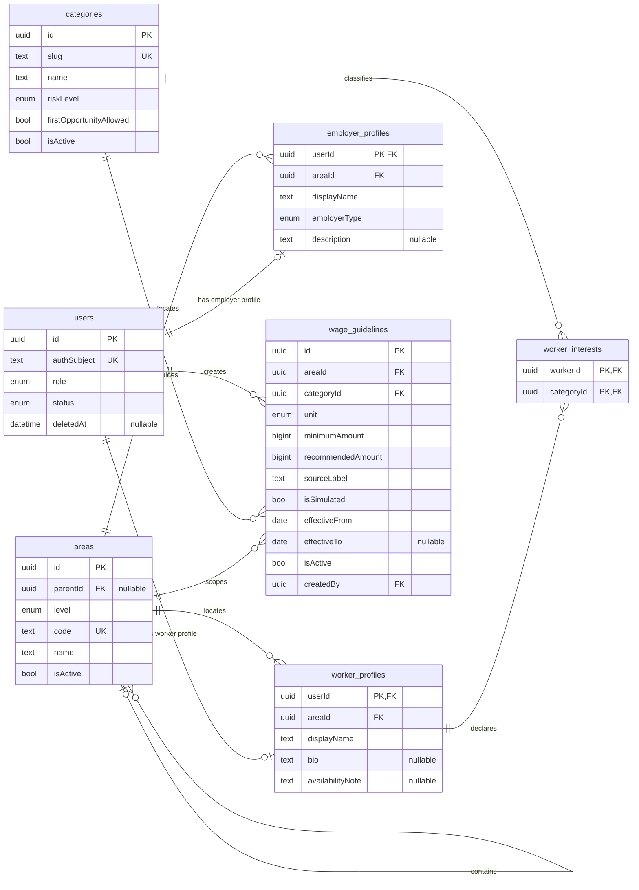
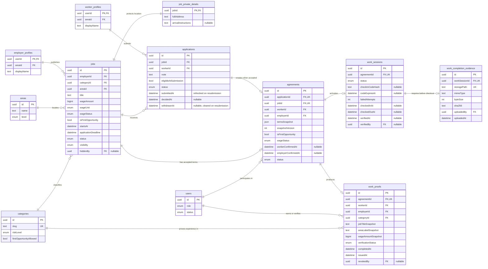
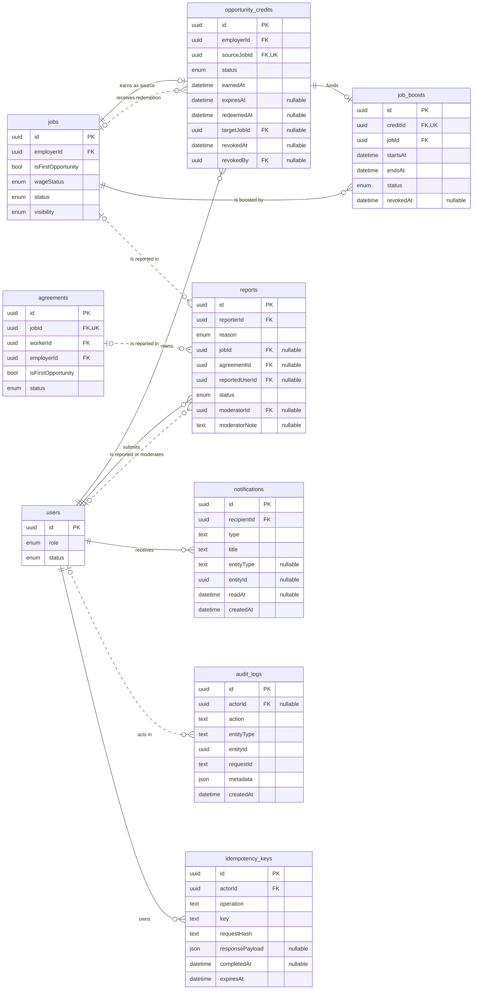

# Rintara Entity Relationship Diagram

> **Version:** 1.0  
> **Date:** July 19, 2026  
> **Status:** Canonical MVP logical ERD  
> **Product authority:** `docs/product/PRD.md`  
> **Domain authority:** `docs/product/BUSINESS_RULES.md`  
> **Column specification:** `docs/engineering/DATABASE.md`

## 1. Scope

This document visualizes the PostgreSQL model required by the Rintara MVP. The model is split into three views so keys and cardinalities remain readable:

1. identity and reference data;
2. hiring and verified-work lifecycle; and
3. rewards, moderation, notifications, audit, and idempotency.

Authentication-provider tables are excluded because the provider is still an open ADR. Rintara links an authenticated identity through `users.auth_subject`.

## 2. Identity and Reference Data

Important rules:

- A user has one role and only the matching role profile.
- `worker_interests` is self-declared and never counts as verified experience.
- Beginner status is calculated from non-revoked Work Proof per worker and category.
- Employer credit balance and Opportunity Giver badge are derived, not profile columns.
- Active Wage Guidelines must not overlap for the same area, category, unit, and effective period.

## 3. Hiring and Verified-Work Lifecycle

### Lifecycle cardinalities

| Parent | Child | Cardinality | Business meaning |
| --- | --- | --- | --- |
| Employer | Job | 1:N | An employer may publish multiple jobs |
| Job | Private detail | 1:1 | Full address is separated from public data |
| Job | Application | 1:N | A job may receive multiple applications |
| Worker | Application | 1:N | A worker may apply to multiple jobs |
| Application | Agreement | 1:0..1 | Only an accepted application creates an agreement |
| Job | Agreement | 1:0..1 | One accepted worker per MVP job |
| Agreement | Work session | 1:0..1 | Created once when both parties confirm |
| Work session | Completion evidence | 1:0..1 | Required after check-in and before checkout |
| Agreement | Work Proof | 1:0..1 | Created only after verified completion |

Rintara Passport is a read model over `work_proofs`; there is no editable `passports` table.

## 4. Rewards, Moderation, and Operations

Important rules:

- One First Opportunity job issues at most one credit through unique `source_job_id`.
- A redeemed credit targets a visible published job owned by the same employer.
- `job_boosts.credit_id` is unique, and active boosts may not overlap for one job.
- The maximum three active credits is enforced transactionally, not with a profile counter.
- A report references at least one job, agreement, or reported user.
- Active reports block relevant completion without adding a `disputed` lifecycle status.
- Notification and audit entity references are controlled polymorphic values, not foreign keys.
- Idempotency is unique by `(actor_id, operation, key)`.

## 5. Critical Foreign Keys

| Table | Foreign keys |
| --- | --- |
| `worker_profiles` | `user_id -> users.id`, `area_id -> areas.id` |
| `employer_profiles` | `user_id -> users.id`, `area_id -> areas.id` |
| `worker_interests` | `worker_id -> worker_profiles.user_id`, `category_id -> categories.id` |
| `wage_guidelines` | `area_id -> areas.id`, `category_id -> categories.id`, `created_by -> users.id` |
| `jobs` | `employer_id -> employer_profiles.user_id`, `category_id -> categories.id`, `area_id -> areas.id` |
| `job_private_details` | `job_id -> jobs.id` |
| `applications` | `job_id -> jobs.id`, `worker_id -> worker_profiles.user_id` |
| `agreements` | `application_id -> applications.id`, `job_id -> jobs.id`, both parties to `users.id` |
| `work_sessions` | `agreement_id -> agreements.id`, optional verifier to `users.id` |
| `work_proofs` | `agreement_id -> agreements.id`, worker/employer to `users.id`, category to `categories.id` |
| `opportunity_credits` | employer/revoker to `users.id`, source/target to `jobs.id` |
| `job_boosts` | `credit_id -> opportunity_credits.id`, `job_id -> jobs.id` |
| `reports` | reporter/moderator/reported user to `users.id`, optional job/agreement targets |
| `notifications` | `recipient_id -> users.id` |
| `audit_logs` | optional `actor_id -> users.id` |
| `idempotency_keys` | `actor_id -> users.id` |

## 6. Constraints Beyond Cardinality

| Invariant | Database/domain enforcement |
| --- | --- |
| Positive wage | `CHECK (jobs.wage_amount > 0)` |
| Application deadline leaves preparation time | `CHECK (jobs.application_deadline < jobs.starts_at - interval '24 hours')` |
| One application per worker/job | `UNIQUE (job_id, worker_id)` |
| One accepted worker per job | Partial unique index on accepted applications |
| One agreement per application and job | Unique constraints on both foreign keys |
| One session/proof per agreement | Unique agreement foreign keys |
| One credit per source job | Unique source job foreign key |
| One boost per credit | Unique credit foreign key |
| Maximum three active credits | Employer-scoped completion transaction |
| No overlapping job boost | Redemption transaction plus time/status index |
| Report has a target | Check requiring at least one target foreign key |
| Same idempotency key cannot change input | Unique key plus request-hash comparison |
| Critical history is retained | Restricted deletes and revocation/cancellation status |

## 7. Derived Product Models

| Product concept | Derived from |
| --- | --- |
| Rintara Passport | Authorized non-revoked `work_proofs` query |
| Beginner status | Absence of verified Work Proof for worker and category |
| Active credit balance | Owned `earned` credits that have not expired |
| Opportunity Giver badge | At least one non-revoked lifetime credit |
| Active boost | Current time within boost window and status not revoked |
| Public job detail | Safe projection that never joins private address data |

Do not create editable Passport rows, stored beginner flags, mutable credit counters, or badge booleans.

## 8. Transaction Boundaries

- `acceptApplication` accepts one worker, rejects remaining applications, fills the job, and creates one agreement snapshot atomically.
- Expiring an unfilled job rejects its submitted applications and writes
  notifications and audit history atomically.
- The second agreement confirmation activates it and creates one work session atomically.
- One work session has at most one private completion-evidence metadata row.
- Checkout requires that metadata row; the binary object remains in private
  storage and is not part of Passport.
- `verifyCompletion` completes session/agreement/job, creates one Work Proof, and conditionally creates one credit atomically and idempotently.
- `redeemOpportunityCredit` consumes one credit and creates one 24-hour boost atomically and idempotently.

Unique constraints are the final safety boundary; UI button states and preflight reads are not concurrency control.
