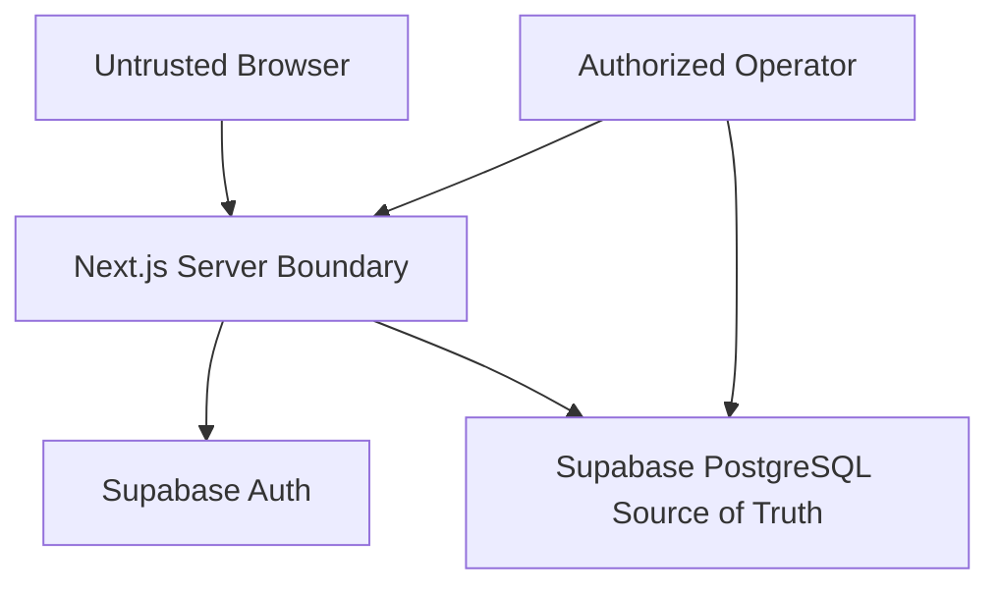

# Rintara Security and Privacy Model

> **Version:** 1.0  
> **Date:** July 18, 2026  
> **Status:** MVP security baseline

## 1. Security Objectives

Rintara must:

- prevent unauthorized access across roles, owners, and agreement parties;
- keep full work addresses private until acceptance;
- prevent forged eligibility, completion, Work Proof, credits, and admin actions;
- preserve one-worker, one-proof, and one-credit invariants under concurrency;
- minimize collection and exposure of personal data;
- resist common web abuse; and
- provide enough audit evidence for moderation and incident response.

Rintara does not guarantee worker quality, payment, legal resolution, or physical safety. Product copy must not imply otherwise.

## 2. Trust Boundaries

Rules:

- Browser input and route parameters are untrusted.
- Session validation occurs on the server.
- Current role, account status, ownership, and party relationship are server-derived.
- PostgreSQL constraints and transactions protect final integrity.
- Operator database access is exceptional, least-privilege, and auditable outside normal user flows.

## 3. Protected Assets

### Confidentiality

- full address and arrival instructions;
- agreement details;
- application notes and applicant identities;
- private profile/contact data;
- reports and moderator notes;
- authentication/session secrets;
- check-in code and verification material;
- database and deployment credentials.

### Integrity

- user role and account status;
- job ownership and lifecycle;
- application decision;
- agreement snapshot and confirmations;
- attendance timestamps;
- Work Proof and verification status;
- Opportunity Credit and Job Boost;
- Wage Guidelines;
- reports, moderator actions, and audit history.

### Availability

- public discovery and job details;
- authenticated golden-path operations;
- PostgreSQL and authentication integration;
- demo/release environment.

## 4. Data Classification

| Class | Examples | Handling |
| --- | --- | --- |
| Public | Published job title, category, general area, wage, schedule | Explicit allowlist; cache only with safe invalidation |
| Account-private | Own notifications, applications, profile settings | Authenticated owner only |
| Relationship-private | Applicant Passport, agreement, full address | Verified job ownership or agreement party |
| Moderation-private | Report description, moderator note, suspension reason | Authorized admin and limited reporter status |
| Secret | Session keys, provider keys, database URLs, code pepper | Secret manager/config only; never returned or logged |
| Prohibited MVP data | Government IDs, bank/card details, continuous GPS, private chat | Do not collect or store |

## 5. Threat Model

| Threat | Example | Primary controls |
| --- | --- | --- |
| Broken object authorization | Employer B guesses Employer A's job/applicant ID | Central ownership/relationship checks, safe not found, negative tests |
| Role tampering | Worker submits `role=admin` | Ignore client role; load trusted role server-side |
| Private-address leakage | Public DTO serializes full ORM row | Separate table/projection, explicit DTO, response tests |
| Double acceptance | Two requests accept different workers | Transaction, row protection, partial unique index |
| Duplicate proof/credit | Retry after timeout | Idempotent completion and unique constraints |
| Credit double spend | Concurrent redemption | Idempotency key, locked/conditional claim, unique boost |
| Check-in brute force | Attacker guesses six-digit code | Short expiry, keyed/one-way storage, five-attempt cap, rate limit, party check |
| Stored XSS | Job description contains script markup | Escaped rendering, no raw HTML without approved sanitizer |
| SQL injection | Filter text reaches query string | Parameterized ORM/SQL and input validation |
| CSRF | Cross-site protected mutation | Auth-provider/framework CSRF model, same-site secure cookies |
| Report abuse | User floods reports to block completion | Relationship validation, rate limits, duplicate detection, admin queue |
| Private photo disclosure | Guessed agreement or object identifier exposes a room photo | Private bucket, server relationship authorization, opaque path, no-store response |
| Image parser/resource abuse | Malformed or oversized upload consumes runtime resources | MIME allowlist, 5 MB input cap, pixel cap, server decode/re-encode, upload rate limit |
| Log leakage | Request body contains address/code | Structured allowlisted logs, no unrestricted payloads |
| Seed/reset damage | Demo reset runs on production | Explicit environment allowlist, production refusal, isolated credentials |
| Dependency compromise | New package introduces malicious code | Lockfile, minimal dependencies, review, vulnerability monitoring |

## 6. Authentication

- Use Supabase Auth through the approved SSR integration.
- Do not build password hashing, reset tokens, session rotation, or OAuth protocol handling in Rintara domain code.
- Verify callback and redirect configuration per Supabase guidance.
- Validate identity on the server with verified claims or a fresh server-confirmed user lookup; do not trust the user object from `getSession()` alone for authorization.
- Use secure, HTTP-only, same-site cookies where supported.
- Keep local, preview, and production tenants/credentials isolated.
- Synchronize only the minimum stable external subject needed by `users.auth_subject`.

ADR-012 records Supabase Auth as the accepted provider. Rintara role, account status, ownership, and relationship authorization remain server-owned domain data.

Implementation locations:

- Supabase browser/server clients: `lib/supabase/`
- Next.js session-refresh boundary: `proxy.ts`
- Verified identity and Rintara context: `server/auth/identity.ts`
- Role, active-account, ownership, and party policies: `server/auth/`

## 7. Authorization

Each private operation checks:

1. valid session;
2. active account;
3. required role;
4. resource ownership or agreement/application relationship;
5. current lifecycle and moderation state; and
6. action-specific eligibility.

Route guards and hidden buttons improve UX but do not authorize data.

Central authorization helpers should produce typed results and be tested independently and through every critical command.

## 8. Private Address Model

- Store full address and arrival instructions in `job_private_details`.
- Public job queries never join the private table.
- Agreement snapshot contains the accepted private address.
- Access is limited to the job owner, accepted worker through agreement context, and authorized admin.
- Do not include address in public HTML, metadata, cache keys, notification copy, analytics, errors, or logs.
- Test anonymous, unrelated worker, unrelated employer, and hidden-job cases.

### 8.1 Private work completion evidence

- Accept one JPG, PNG, or WebP input up to 5 MB only from the accepted worker
  while the related session is `checked_in`.
- Decode and re-encode as bounded WebP without copying EXIF, XMP, ICC, filename,
  or caller-provided metadata.
- Keep the Supabase bucket private and its service-role credential server-only.
- Store the object path only in PostgreSQL and never return it to the browser.
- Stream through an authenticated, relationship-authorized, no-store endpoint.
- Permit the related worker, related employer, and authorized admin only.
- Serialize metadata replacement and checkout on the work-session row.
- Never log image bytes, multipart bodies, object credentials, private paths,
  or image contents.

## 9. Check-In Code Protection

Because a six-digit code has low entropy:

- generate using a cryptographically secure random source;
- store using a keyed HMAC with a server-held pepper/key or another explicitly reviewed construction, not a fast unkeyed hash;
- compare in constant-time where the chosen primitive supports it;
- expire after 15 minutes;
- allow at most five failed attempts;
- bind verification to the accepted worker and agreement;
- invalidate on successful use or replacement;
- show plaintext only in the immediate generation response; and
- never log code input, hash, or unrestricted request bodies.

## 10. Transaction Integrity

`acceptApplication`, `verifyCompletion`, and `redeemOpportunityCredit` follow the exact transaction rules in `docs/product/BUSINESS_RULES.md` and `docs/engineering/DATABASE.md`.

Security properties depend on database constraints. Client-side disabling, preflight reads, and process memory do not protect concurrent requests.

## 11. Input and Output Controls

- Parse all server input from `unknown` using strict schemas.
- Bound text lengths, page sizes, date ranges, and numeric amounts.
- Reject or ignore unknown sensitive fields.
- Normalize currency to integer rupiah.
- Use explicit DTO allowlists.
- Escape user text by default.
- Avoid user-controlled redirects and URLs.
- Map internal errors to stable safe codes.

## 12. Abuse and Rate Limits

Rate-limit at minimum:

- sign-in and authentication recovery according to provider capability;
- account/profile creation;
- job publication;
- application submission;
- check-in code generation and verification;
- reports; and
- admin authentication.

Rate-limit keys must avoid exposing raw personal identifiers in logs. Limits should account for shared networks and provide safe recovery rather than permanent lockout.

## 13. Logging and Audit

Operational logs may include request ID, command name, duration, result class, safe error code, and release identifier.

Do not log:

- passwords, tokens, cookies, or provider payloads;
- full addresses;
- application/report free text;
- check-in code or hash;
- raw request/response bodies; or
- database URLs and secret configuration.

Business audit records are append-only and allowlisted. They are not a substitute for secure operational access logs.

## 14. Data Retention and Deletion

The production retention schedule remains an open policy decision before collecting pilot data.

MVP rules:

- logical deletion for users and lifecycle resources;
- retain cancellation/revocation reason and critical audit history;
- do not hard-delete to repair state;
- minimize free-text data;
- define access and deletion request handling before public pilot; and
- do not retain demo data beyond operational need.

## 15. Security Test Gate

- [ ] Authorization matrix passes.
- [ ] Public/private DTO tests pass.
- [ ] Concurrent acceptance/completion/redemption tests pass.
- [ ] Check-in invalid/expired/reused/locked paths pass.
- [ ] Input validation and stored-content rendering are reviewed.
- [ ] Secrets are absent from source, client bundle, logs, and screenshots.
- [ ] Reset/migration commands refuse unsafe environments.
- [ ] Dependency and build checks pass.
- [ ] Incident contact and operator are assigned.

## 16. Review Triggers

Revisit this model before adding payments, identity verification, file uploads, chat, GPS, public Passport sharing, third-party APIs, multi-worker jobs, or a new source of truth.
