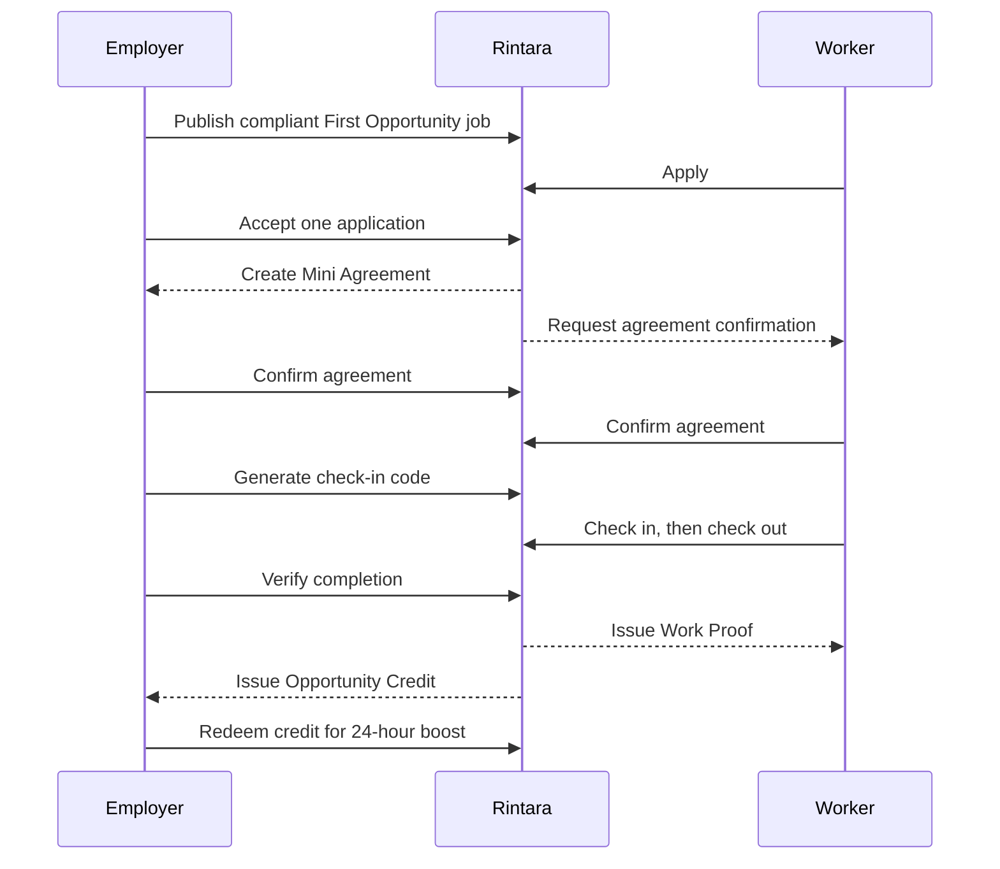

# Rintara User Flows

> **Version:** 3.6
>
> **Date:** July 26, 2026
>
> **Status:** MVP experience baseline
>
> **Requirements:** `docs/product/REQUIREMENTS.md`
>
> **Domain rules:** `docs/product/BUSINESS_RULES.md`

## 1. Flow Principles

- Show one primary action per screen or workflow step.
- State the wage, task scope, schedule, and general area before a worker applies.
- Never expose a full address before one worker is accepted.
- Use server-calculated eligibility and status; do not ask users to declare themselves eligible.
- Explain why an action is unavailable and what the user can do next.
- Preserve entered form data after recoverable validation or network errors.
- Use plain product language instead of technical terms such as transaction, escrow, or state machine.
- Keep the next action visually dominant. Supporting totals and history use
  compact rows, description lists, or timelines so they do not compete with
  the current step.
- On public screens, compact navigation stays beside the geometric Rintara
  **R**. **Untuk pekerja** and **Untuk pemberi kerja** open concise audience
  menus with useful destinations inside their dedicated flows. **Kategori
  kerja**, **Cara kerja**, and **Mengapa Rintara** remain direct routes.
  Audience menus may use canonical job filters or anchors owned by the
  dedicated guide pages, but they do not duplicate unrelated top-level
  destinations. The header begins as a contained lightly frosted row and
  gradually condenses into a stronger translucent blurred floating bar across
  the opening scroll distance.
- The light-only homepage opens with one joined split hero: a Deep Forest
  search panel beside a documentary local-work photograph. Its native GET
  search sends task and area filters to `/jobs`.
- The homepage introduces information safeguards, active categories and areas,
  a compact gateway to the dedicated Worker and Employer guides, and Rintara's
  agreement-to-proof mechanism. Published-job rows belong only to `/jobs`; the
  homepage does not duplicate the discovery list.
- Public and authenticated routes use one light appearance and expose no
  appearance switch.
- Public content is visible immediately. Do not gate pages, forms, cards, or
  ordinary sections behind automatic entrance, list stagger, scroll-reveal,
  pointer-tracking, particle, or decorative canvas effects.
- Documentary images never add a step before the relevant task or become a
  gallery, parallax scene, or heavy motion system.

## 2. Actors

| Actor    | Main objective                                                                       |
| -------- | ------------------------------------------------------------------------------------ |
| Visitor  | Understand Rintara and browse safe public job information                            |
| Worker   | Find work, apply, complete an agreement, and build a verified Passport               |
| Employer | Publish a transparent job, hire one worker, verify completion, and use earned credit |
| Admin    | Maintain trusted reference data and process safety or integrity issues               |

## 3. Golden Path

### 3.1 Public homepage gateway

1. Visitor sees the Rintara proposition in a Forest editorial panel beside a
   documentary local-work scene.
2. Visitor may open `/jobs` directly or submit the task-and-area search inside
   the Forest panel. The form uses GET so the resulting discovery URL remains
   shareable.
3. Visitor may narrow discovery through active category or city/regency links.
   These options come from public reference data and never imply unsupported
   popularity or demand.
4. Visitor sees concise factual safeguards: terms are visible before
   application, the full address stays private until acceptance, and verified
   completion becomes Work Proof.
5. Visitor can open `/for-workers` or `/for-employers` from one compact
   audience gateway. Each dedicated page owns the deeper role-specific steps
   and action.
6. `/for-workers` explains First Opportunity as paid work with
   category-specific system-calculated eligibility and links to filtered job
   discovery.
7. Visitor can review the concise compare, agree, attend, verify, and Work
   Proof mechanism before opening the complete **Cara kerja** page.

The legacy `/first-opportunity` route resolves directly to
`/jobs?opportunity=first`. The homepage contains no published-job list,
testimonial, employer logo, marketplace metric, direct worker search, ranking
claim, or payment feature.
All published-job browsing and empty/loading/error states remain owned by
`/jobs`.

### 3.2 Public guidance and directory pages

1. **Untuk pekerja** opens `/for-workers`, where a visitor can review visible
   job information, the application-to-proof path, First Opportunity rules,
   and address privacy before opening `/jobs`.
2. **Untuk pemberi kerja** opens `/for-employers`, where a visitor can review
   publishing requirements, the one-worker lifecycle, private-address
   handling, external payment, and qualifying Opportunity Credit behavior
   before starting the role-aware publish action.
3. **Kategori kerja** opens `/categories`, which renders active category and
   city/regency reference data. Each item opens `/jobs` with one shareable
   filter; the page never invents demand, popularity, or job counts.
4. **Mengapa Rintara** opens `/why-rintara`, which explains the factual chain
   from visible terms to Mini Agreement, Work Proof, Passport, and qualifying
   credit, together with the limits of Rintara's data and payment role.

## 4. Registration and Onboarding

### 4.1 New worker

1. Visitor selects **Create account**.
2. Authentication provider completes the approved registration flow.
3. Rintara asks the user to choose **Find work** or **Offer work**.
4. User selects **Find work**.
5. Worker enters display name, selects an active city/regency, and may add a short biography, an availability note, and up to eight category interests.
6. The interface explains that interests are self-declared and are never treated as Work Proof or First Opportunity eligibility.
7. Server revalidates the active area and categories, then creates the account, worker profile, and interests together while fixing the active role as `worker`.
8. Worker lands on the worker dashboard. An accepted application is shown
   first when it needs agreement confirmation; otherwise the page leads with
   recent jobs and the Worker's latest application activity.

Recovery and rules:

- If auth succeeds but profile creation fails, onboarding resumes after the next sign-in.
- Role is not accepted from a client-side redirect or URL parameter.
- User does not see a “first-time worker” checkbox; eligibility is calculated by category.
- If an area or category becomes unavailable before submission, retain the entered profile data, show a safe error, and let the worker choose again.
- While the profile is being saved, prevent a second submission and keep a transport failure recoverable on the same screen.
- A returning worker edits only their own server-loaded profile and chooses from
  currently active areas and categories. Unavailable previous selections require
  a visible replacement or removal before saving.
- Category interests remain self-declared. Any per-category verified-experience
  label is derived from Work Proof and cannot be edited in the profile form.

### 4.2 New employer

1. Visitor completes registration.
2. User selects **Offer work**.
3. Employer enters display/business name, type, an active city/regency, and optional description.
4. Server revalidates the active area and creates the employer profile and role together.
5. Employer lands on the employer dashboard with a **Post a job** primary
   action. The dashboard surfaces one real next action from the Employer's
   jobs, recent owned jobs, and a compact Opportunity Credit summary.

If the selected area becomes unavailable or saving is interrupted, keep the
entered values on screen, explain the recoverable problem, and allow retry.
A returning employer must replace an inactive saved area before profile changes
can be stored.

### 4.3 Returning or inactive account

- An authenticated user with incomplete onboarding returns to the missing step.
- A suspended user sees a neutral account-restricted page and cannot execute protected operations.
- A deleted account cannot re-enter product flows through an old session.
- Admin accounts are provisioned through an internal operational process and use the common sign-in flow; public onboarding never offers the `admin` role.
- On public pages, a ready authenticated account replaces **Masuk** and
  **Daftar** with one circular profile control. Its dropdown shows only the
  current role's dashboard shortcuts: applications and Passport for a Worker;
  job publishing, owned jobs, and Opportunity Credit for an Employer; and a
  minimal operational fallback for an Admin. Incomplete and restricted
  accounts receive only their safe recovery destination. Every authenticated
  state retains **Keluar dari akun**, with duplicate activation prevented and
  a recoverable error shown in place if sign-out fails.
- Inside a role workspace, notifications remain a dedicated header control for
  Workers and Employers. A circular profile control beside it exposes the
  current role's profile and secondary destinations plus sign-out. Admin has
  no fake notification control. The desktop sidebar and mobile bottom
  navigation contain only the role's four core destinations, and exactly one
  destination is marked current for nested routes.

Shared authentication presentation:

- Registration, role selection, and profile setup retain the visible
  three-stage journey: Akun, Peran, Profil.
- Sign-in and registration use a stable split composition on large screens:
  the separate portrait documentary asset
  `public/visuals/rintara-auth-work-v1.webp` occupies the visual panel and the
  focused form remains in a plain readable column. On narrow screens, the
  image becomes a short reserved-height crop before the form.
- `/sign-in` and `/register` remain valid entry URLs, but share one persistent
  authentication frame. Moving between **Masuk** and **Daftar** changes only
  the focused form panel; the documentary image, header, and shared field
  state remain mounted. Browser history and refresh continue to restore the
  mode represented by the URL.
- The mode change uses a compact two-option segmented control above the active
  form. A single selected pill slides between **Masuk** and **Daftar** to make
  the state change continuous. Each option retains the canonical URL, and the
  alternate option is unavailable while a credential request is pending.
  Email is shared across modes, while current-password and new-password drafts
  remain separate.
- Role selection and Worker/Employer profile onboarding remain operational:
  they use the narrow 10.5rem Deep Forest identity rail and centered bordered
  form without a documentary image.
- Authentication errors remain on the sign-in screen with safe recovery copy;
  provider messages are not exposed.
- When registration cannot distinguish a new unconfirmed signup from an
  existing account, it shows one neutral continuation state instead of a
  provider error. The state never confirms whether the email is registered and
  offers direct **Masuk ke akun** and **Pulihkan kata sandi** actions while
  retaining the email draft and validated destination.
- **Lupa kata sandi?** opens `/forgot-password`. The request always shows the
  same confirmation regardless of whether the email is registered. A valid
  Supabase recovery callback opens `/reset-password`; an invalid or expired
  callback returns to recovery with a safe retry message.
- Rintara uses one light appearance; authentication exposes no appearance
  switch and never resets entered fields during route changes or recovery.
- When authentication starts from a protected public action, sign-in, registration, and onboarding preserve the validated internal destination and return the completed user there.

### 4.4 Admin configures the marketplace

1. Active admin opens **Kategori, area, dan Panduan Upah**.
2. Admin creates or activates the pilot city/regency and category.
3. Admin creates a Wage Guideline version for one active area, category, and
   wage unit, including source and simulation labeling.
4. Admin may deactivate or reactivate an existing record; each change is
   audited.
5. The next employer job form and public discovery read the updated active
   configuration.

An active Wage Guideline period cannot overlap another active guideline for the
same area, category, and unit. Creation or reactivation keeps the submitted
configuration visible and explains the conflicting period without changing
either record.

Configuration lists use independent bounded cursors so advancing one list does
not reset the other two.

During initial navigation, the loading skeleton preserves the configuration
page's form and summary layout. After authorization, category and pilot-area
forms may render while Wage Guideline options and saved configuration lists
continue loading within stable section-level placeholders.

## 5. Employer Creates and Publishes a Job

1. Employer selects **Post a job**.
2. Rintara collects information in short sections:
   1. job title, category, and tasks;
   2. general area and private full address;
   3. schedule and estimated duration;
   4. wage amount, unit, payment type (cash/COD or non-cash), the selected
      non-cash method when applicable, and payment timing;
   5. tools and risk questions;
   6. application deadline and First Opportunity option; Rintara derives and
      displays the employer selection cutoff 24 hours before the start time.
3. The interface shows the applicable Wage Guideline with source/simulation label.
4. Employer saves a draft or selects **Review job**.
5. Review screen clearly distinguishes public information from details visible only after acceptance.
6. Employer selects **Publish job**.
7. Server validates every field and calculates wage compliance.
8. On success, employer sees the published job and a share/browse-safe link.

Alternative paths:

- Below-guideline wage: explain the reference and block the First Opportunity option. A normal job may continue with a visible warning if product policy allows it.
- No guideline: block First Opportunity publishing and explain that reference data is unavailable.
- Restricted category/risk: disable First Opportunity and show a safety explanation.
- Past schedule/deadline, or an application deadline that is not earlier than
  the selection cutoff: highlight the field and retain all other input.
- Expected server validation and lifecycle failures return to the form as a
  typed result, highlight the first affected field, and retain all input.
  Only an actual rejected transport request uses connection-recovery copy.
- If no active area or category is available, show an unavailable state and
  disable draft/publish actions until configuration is restored.
- Published terms need change: employer cancels the job and creates a new draft; published terms are not silently edited.

## 6. Worker Discovers and Applies to a Job

1. Worker opens `/jobs`, the only public route that lists published jobs.
   Homepage search, category, area, and First Opportunity links resolve here.
2. Worker optionally searches or filters by category, general area, wage range,
   and First Opportunity. Wage fields format input as Indonesian Rupiah while
   retaining digit-only values in the shareable query.
3. Desktop places filters in a sticky 20rem side rail that contains long
   category labels and wage fields without crossing into the results column;
   mobile opens the same filters in a sheet. Compact job rows show title,
   category, employer, area, wage, schedule, duration, First Opportunity label,
   and boost label when active. List position never creates a featured status.
4. Worker opens a job detail.
5. Rintara presents a dense decision header with title, employer, task
   summary, wage, general area, schedule, duration, application deadline, and
   applicable semantic status before the action. Payment/tool terms and the
   privacy notice follow; the full address remains hidden.
6. For a First Opportunity job, the server checks the worker's category proof.
7. For an active Worker, the detail action privately reads the current
   application state before showing a form. A withdrawn application may show a
   fresh form while the job still accepts applications; otherwise a previous
   application is shown as its recorded status.
8. Eligible worker selects **Apply**, writes a short note, reviews the fixed
   wage, and submits.
9. Worker sees the submitted status in **My applications** and the Employer
   receives a safe job-linked notification that does not copy the note or
   private address.
10. **My applications** separates active (`submitted`, `accepted`) and history
    (`rejected`, `withdrawn`) before pagination. Closed job titles remain
    readable but do not link to an unavailable public detail; accepted
    applications link to their Mini Agreement when one exists.

Discovery, **My applications**, employer jobs, and applicant lists expose
forward navigation only when another bounded cursor page exists. The next link
preserves active filters, labels counts as page-local, and never displays the
opaque cursor as user-facing content.

Alternative paths:

- Minimum wage exceeds maximum wage: keep both values, show an inline field
  error, and do not run the search until the range is corrected. A malformed
  filter URL offers a direct return to the unfiltered job list.
- Anonymous visitor sees a sign-in gate instead of an editable application form. Selecting it opens sign-in and returns the completed user to the same job after any required registration and onboarding.
- On narrow screens, a compact application action may remain docked while the application section is offscreen; it leaves the accessibility tree when that section or the footer becomes visible.
- Employer account selects a worker action: show role-appropriate guidance, not an application form.
- Worker is already verified in that category: explain that the specific job is reserved for a first opportunity and suggest other jobs.
- Duplicate application: show the existing application rather than creating another.
- Withdrawn application on a job that still accepts applications: show a new
  note form, then reactivate the same application record when submitted.
- Job closes during submission: show that it is no longer available and return to discovery.
- Worker may withdraw while status is `submitted`; the Employer receives one
  safe update and a repeated withdrawal does not create another notification.
- Worker may resubmit a withdrawn application only while the job remains
  published, visible, before its application deadline, and the worker remains
  eligible. The new note replaces the withdrawn note and the Employer receives
  a safe resubmission notification.

## 7. Employer Reviews and Accepts an Applicant

1. Employer opens one of their published jobs.
2. Employer selects **Review applicants**.
3. Applicant cards show display name, general area, application note, category eligibility, and verified proof summary.
4. While the application remains `submitted`, employer may open the applicant's
   separately paginated authorized Passport view.
5. The applicant view shows when new applications close and the employer
   selection cutoff 24 hours before the start time.
6. Employer selects **Accept worker** and reviews the fixed terms.
7. Confirmation explains that one worker will be accepted, other submitted applications will be rejected, and terms will become an agreement snapshot.
8. Employer confirms.
9. Server runs the atomic acceptance operation.
10. On success, employer goes to the pending agreement; selected worker receives an acceptance notification and other applicants receive a rejection notification.

Alternative paths:

- Worker gained relevant proof after applying: acceptance is blocked with a clear eligibility explanation.
- Application deadline passes: close new applications, but keep existing
  submitted applications reviewable and selectable until the selection cutoff.
- Selection cutoff passes before the employer confirms: show that selection is
  closed and create no agreement. The expiry workflow then expires the job and
  rejects remaining submitted applications.
- Another acceptance request wins first: show the job as already filled and refresh applicant statuses.
- Employer opens another employer's applicant URL: respond with not found/forbidden behavior without leaking applicant data.
- Employer revisits Passport after the application leaves `submitted`: close
  applicant-review access and return safe not-found behavior.
- Database operation fails: no applicant is partially accepted and the employer can retry.

## 8. Mini Agreement Confirmation

1. Each party opens the agreement from dashboard or notification.
2. Agreement shows parties, task scope, full address, schedule, wage, payment timing/method, tools, cancellation wording, and First Opportunity label.
3. Each party independently selects **I agree to these terms**.
4. Rintara records each confirmation time.
5. After the first confirmation, the other party receives a safe confirmation request.
6. When both have confirmed, agreement becomes active, both parties are notified, and the work step becomes available.

Rules and recovery:

- Confirmation order does not matter.
- Repeated or concurrent confirmation is safe and does not duplicate the work session, notification, or audit record.
- If terms are wrong, do not provide an edit button; direct the party to the cancellation/report route.
- Only the parties and authorized admin can open the full agreement.

## 9. Check-In and Check-Out

### 9.1 Check-in

1. Near the work start, employer opens the active agreement.
2. Employer selects **Generate check-in code**.
3. Rintara displays a six-digit code, 15-minute expiry, and a warning not to post it publicly.
4. Worker opens the work screen and enters the code.
5. Server verifies code, party, expiry, usage, and attempt count.
6. On success, Rintara records check-in and changes the job to in progress.

Alternative paths:

- Expired code: employer generates a replacement; previous code becomes unusable.
- Invalid code: show remaining-safe guidance without revealing expected digits; rate-limit repeated failures.
- Inactive agreement: block check-in and link back to pending confirmation.

### 9.2 Check-out

1. After finishing, worker selects one result photo without people or personal
   information.
2. Rintara validates JPG/PNG/WebP and the 5 MB limit, removes embedded
   metadata by normalizing the image, and stores it privately.
3. Worker may replace the photo while still checked in.
4. Once a photo is stored, worker selects **Check out**, may add a short
   completion note, and confirms.
5. Rintara records server time, locks the photo against replacement, and
   notifies employer to verify completion.

Check-out is available once, only after check-in, and only after one evidence
photo exists. Rintara does not collect continuous GPS. The photo is available
only to the related worker, related employer, and authorized admin.

## 10. Completion, Work Proof, and Passport

1. Employer opens the completion request.
2. Employer reviews job terms, attendance timestamps, private result photo,
   and worker note.
3. Employer selects **Verify completion**.
4. Confirmation explains that completion will issue permanent work history and may issue an Opportunity Credit.
5. Server checks states, ownership, and active reports, then runs the atomic completion operation.
6. Worker receives a Work Proof notification and sees the new Passport entry.
7. If reward conditions and balance cap permit, employer receives one Opportunity Credit.
8. Both work screens replace pending actions with an explicit completed state;
   the Worker can open Paspor Rintara and the Employer can open the completed
   job. Job lists and public discovery refresh to the completed lifecycle state.

Alternative paths:

- Active report: completion is paused and both parties see a neutral moderation message.
- Repeated click/network retry: return the existing successful proof and credit outcome.
- Employer already holds three active credits: completion and proof still succeed; explain that no additional credit was added because the active limit is three.
- Non-First Opportunity job: completion and proof succeed without a credit.

## 11. Redeem Opportunity Credit

1. Employer opens **Opportunity Credits**.
2. Screen shows active credits, lifetime opportunity count, badge state, and credit history.
3. Employer selects an active credit and chooses one owned published job without an active boost.
4. Employer reviews **Boost for 24 hours** and confirms.
5. Server redeems the credit and creates the boost atomically.
6. Success view shows exact start/end time and links to the boosted job.

Alternative paths:

- Credit is no longer active: refresh balance and explain the status.
- Target job was cancelled/filled: require another published job.
- Target job already has an active boost: do not consume the credit.
- Retry uses the same idempotency key and returns the original result.

## 12. Report and Moderation Flow

### 12.1 User submits a report

1. Authenticated user opens **Report a problem** from an accessible job, agreement, or relevant profile context.
2. User selects a defined reason and adds an optional factual description.
3. Rintara explains what reports can and cannot resolve.
4. User submits; server verifies relationship and applies rate limits.
5. User opens **Laporan saya** to see the report reference and current status
   without private moderator notes.
6. If related work is unfinished, completion is blocked while report is active.

### 12.2 Admin processes a report

1. Admin opens the report queue.
2. Admin claims/starts review, changing status to `reviewing`.
3. Admin examines the relevant job, agreement, parties, audit entries, and prior actions.
4. Admin chooses `resolved` or `rejected`, writes a factual note, and selects explicit actions.
5. Rintara applies actions consistently and writes audit history.
6. Parties receive safe status notifications without private moderator notes.

Possible admin actions include hide/cancel job, suspend account, cancel unfinished workflow, revoke Work Proof, revoke an earned or redeemed credit, and deactivate a related boost.

## 13. Notifications

Notification center covers:

- application submitted, withdrawn, accepted, or rejected;
- agreement confirmation requested or activated;
- check-in and check-out status;
- completion verification requested or completed;
- Work Proof, credit, and boost changes; and
- report status changes.

User opens notification to the authorized destination. If the destination is no longer accessible, show a safe unavailable state. Polling/revalidation is sufficient; immediate realtime delivery is not promised.
Worker and employer feeds provide **Tandai dibaca**, **Tandai semua dibaca**,
and bounded cursor pagination.

## 14. Privacy Flow Rules

| Stage                      | Worker can see                  | Employer can see                  | Public can see             |
| -------------------------- | ------------------------------- | --------------------------------- | -------------------------- |
| Published job              | Public terms, general area      | Own full draft/details            | Public terms, general area |
| Submitted application      | Own application                 | Applicant and authorized Passport | Nothing about applicants   |
| Accepted/pending agreement | Full accepted terms and address | Full accepted terms and address   | Job no longer in discovery |
| Completed                  | Own agreement and proof         | Own agreement and completion      | No private completion data |

Opening a guessed URL never bypasses these rules.

## 15. Required UI States Per Flow

Every primary screen specifies:

- initial loading or skeleton;
- zero/empty state with one next action;
- field and form validation;
- permission/unavailable state;
- recoverable network or server error with retry;
- success confirmation;
- disabled/submitting state that prevents accidental duplicates; and
- refreshed state after a concurrent change.

## 16. Live Demo Flow

Prepare two isolated sessions and deterministic data:

1. Employer publishes a compliant **Event Helper** First Opportunity job.
2. Worker with no proof in that category applies.
3. Employer reviews eligibility and accepts the worker.
4. Both parties confirm the Mini Agreement.
5. Employer generates code; worker checks in and out.
6. Employer verifies completion.
7. Worker Passport displays the first Work Proof.
8. Employer receives a credit and redeems it on a pre-created published job.

The live path should take four to five minutes. Prepare a safe reset and backup recording, but do not use the recording as a substitute when the live system works.
