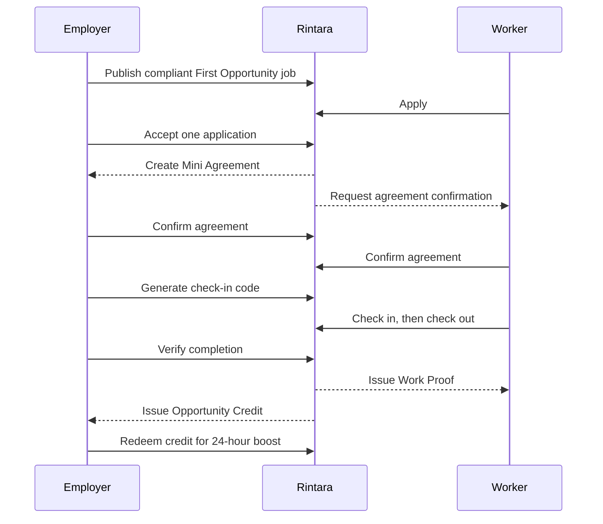

# Rintara User Flows

> **Version:** 3.1
>
> **Date:** July 19, 2026
>
> **Status:** MVP experience baseline
>
> **Requirements:** `docs/product/REQUIREMENTS.md`
>
> **Domain rules:** `docs/product/BUSINESS_RULES.md`

## 1. Flow Principles

- Show one primary action per screen or workflow step.
- State the wage, task scope, schedule, and general area before a worker applies.
- Never expose a full address before one worker is accepted.
- Use server-calculated eligibility and status; do not ask users to declare themselves eligible.
- Explain why an action is unavailable and what the user can do next.
- Preserve entered form data after recoverable validation or network errors.
- Use plain product language instead of technical terms such as transaction, escrow, or state machine.
- Keep the next action visually dominant. Supporting totals and history use open rails or timelines so they do not compete with the current step.
- On the public landing screen, the compact navigation stays beside the Rintara identity, while the opportunity, agreement, and Work Proof preview remains one clear visual sequence without overlapping artifacts.
- Public sections below the first viewport may reveal once as the visitor scrolls. The effect never blocks content, repeats on reverse scrolling, or overrides reduced-motion preferences.

## 2. Actors

| Actor | Main objective |
| --- | --- |
| Visitor | Understand Rintara and browse safe public job information |
| Worker | Find work, apply, complete an agreement, and build a verified Passport |
| Employer | Publish a transparent job, hire one worker, verify completion, and use earned credit |
| Admin | Maintain trusted reference data and process safety or integrity issues |

## 3. Golden Path

## 4. Registration and Onboarding

### 4.1 New worker

1. Visitor selects **Create account**.
2. Authentication provider completes the approved registration flow.
3. Rintara asks the user to choose **Find work** or **Offer work**.
4. User selects **Find work**.
5. Worker enters display name, selects an active city/regency, and may add a short biography, an availability note, and up to eight category interests.
6. The interface explains that interests are self-declared and are never treated as Work Proof or First Opportunity eligibility.
7. Server revalidates the active area and categories, then creates the account, worker profile, and interests together while fixing the active role as `worker`.
8. Worker lands on the worker dashboard with suggested next steps: complete profile, browse jobs, or learn about First Opportunity.

Recovery and rules:

- If auth succeeds but profile creation fails, onboarding resumes after the next sign-in.
- Role is not accepted from a client-side redirect or URL parameter.
- User does not see a “first-time worker” checkbox; eligibility is calculated by category.
- If an area or category becomes unavailable before submission, retain the entered profile data, show a safe error, and let the worker choose again.
- While the profile is being saved, prevent a second submission and keep a transport failure recoverable on the same screen.

### 4.2 New employer

1. Visitor completes registration.
2. User selects **Offer work**.
3. Employer enters display/business name, type, an active city/regency, and optional description.
4. Server revalidates the active area and creates the employer profile and role together.
5. Employer lands on the employer dashboard with a **Post a job** primary action.

If the selected area becomes unavailable or saving is interrupted, keep the
entered values on screen, explain the recoverable problem, and allow retry.

### 4.3 Returning or inactive account

- An authenticated user with incomplete onboarding returns to the missing step.
- A suspended user sees a neutral account-restricted page and cannot execute protected operations.
- A deleted account cannot re-enter product flows through an old session.
- Admin accounts are provisioned through an internal operational process and use the common sign-in flow; public onboarding never offers the `admin` role.

Shared authentication presentation:

- Sign-in, registration, role selection, and profile setup use one visible three-stage journey: Account, Role, Profile.
- Authentication errors remain on the sign-in screen with safe recovery copy; provider messages are not exposed.
- Switching light or dark appearance does not reset entered fields or change the active authentication route.
- When authentication starts from a protected public action, sign-in, registration, and onboarding preserve the validated internal destination and return the completed user there.

## 5. Employer Creates and Publishes a Job

1. Employer selects **Post a job**.
2. Rintara collects information in short sections:
   1. job title, category, and tasks;
   2. general area and private full address;
   3. schedule and estimated duration;
   4. wage amount, unit, payment method, and payment timing;
   5. tools and risk questions;
   6. application deadline and First Opportunity option.
3. The interface shows the applicable Wage Guideline with source/simulation label.
4. Employer saves a draft or selects **Review job**.
5. Review screen clearly distinguishes public information from details visible only after acceptance.
6. Employer selects **Publish job**.
7. Server validates every field and calculates wage compliance.
8. On success, employer sees the published job and a share/browse-safe link.

Alternative paths:

- Below-guideline wage: explain the reference and block the First Opportunity option. A normal job may continue with a visible warning if product policy allows it.
- No guideline: block First Opportunity publishing and explain that reference data is unavailable.
- Restricted category/risk: disable First Opportunity and show a safety explanation.
- Past schedule/deadline: highlight the field and retain all other input.
- Published terms need change: employer cancels the job and creates a new draft; published terms are not silently edited.

## 6. Worker Discovers and Applies to a Job

1. Worker opens job discovery.
2. Worker optionally filters by category, general area, wage range, and First Opportunity.
3. Job cards show title, category, area, wage, schedule, First Opportunity label, and boost label when active.
4. Worker opens a job detail.
5. Rintara shows full public terms, employer summary, Wage Guideline status, and application deadline; the full address remains hidden.
6. For a First Opportunity job, the server checks the worker's category proof.
7. Eligible worker selects **Apply**, writes a short note, reviews the fixed wage, and submits.
8. Worker sees the submitted status in **My applications**.

Alternative paths:

- Anonymous visitor sees a sign-in gate instead of an editable application form. Selecting it opens sign-in and returns the completed user to the same job after any required registration and onboarding.
- On narrow screens, a compact application action may remain docked while the application section is offscreen; it leaves the accessibility tree when that section or the footer becomes visible.
- Employer account selects a worker action: show role-appropriate guidance, not an application form.
- Worker is already verified in that category: explain that the specific job is reserved for a first opportunity and suggest other jobs.
- Duplicate application: show the existing application rather than creating another.
- Job closes during submission: show that it is no longer available and return to discovery.
- Worker may withdraw while status is `submitted`.

## 7. Employer Reviews and Accepts an Applicant

1. Employer opens one of their published jobs.
2. Employer selects **Review applicants**.
3. Applicant cards show display name, general area, application note, category eligibility, and verified proof summary.
4. Employer may open the applicant's authorized Passport view.
5. Employer selects **Accept worker** and reviews the fixed terms.
6. Confirmation explains that one worker will be accepted, other submitted applications will be rejected, and terms will become an agreement snapshot.
7. Employer confirms.
8. Server runs the atomic acceptance operation.
9. On success, employer goes to the pending agreement; selected worker receives an acceptance notification and other applicants receive a rejection notification.

Alternative paths:

- Worker gained relevant proof after applying: acceptance is blocked with a clear eligibility explanation.
- Another acceptance request wins first: show the job as already filled and refresh applicant statuses.
- Employer opens another employer's applicant URL: respond with not found/forbidden behavior without leaking applicant data.
- Database operation fails: no applicant is partially accepted and the employer can retry.

## 8. Mini Agreement Confirmation

1. Each party opens the agreement from dashboard or notification.
2. Agreement shows parties, task scope, full address, schedule, wage, payment timing/method, tools, cancellation wording, and First Opportunity label.
3. Each party independently selects **I agree to these terms**.
4. Rintara records each confirmation time.
5. When both have confirmed, agreement becomes active and the work step becomes available.

Rules and recovery:

- Confirmation order does not matter.
- Repeated confirmation is safe and does not duplicate records.
- If terms are wrong, do not provide an edit button; direct the party to the cancellation/report route.
- Only the parties and authorized admin can open the full agreement.

## 9. Check-In and Check-Out

### 9.1 Check-in

1. Near the work start, employer opens the active agreement.
2. Employer selects **Generate check-in code**.
3. Rintara displays a six-digit code, 15-minute expiry, and a warning not to post it publicly.
4. Worker opens the work screen and enters the code.
5. Server verifies code, party, expiry, usage, and attempt count.
6. On success, Rintara records check-in and changes the job to in progress.

Alternative paths:

- Expired code: employer generates a replacement; previous code becomes unusable.
- Invalid code: show remaining-safe guidance without revealing expected digits; rate-limit repeated failures.
- Inactive agreement: block check-in and link back to pending confirmation.

### 9.2 Check-out

1. After finishing, worker selects **Check out**.
2. Worker may add a short completion note.
3. Worker confirms.
4. Rintara records server time and notifies employer to verify completion.

Check-out is available once and only after check-in. There is no GPS collection or evidence-photo upload in the MVP.

## 10. Completion, Work Proof, and Passport

1. Employer opens the completion request.
2. Employer reviews job terms, attendance timestamps, and worker note.
3. Employer selects **Verify completion**.
4. Confirmation explains that completion will issue permanent work history and may issue an Opportunity Credit.
5. Server checks states, ownership, and active reports, then runs the atomic completion operation.
6. Worker receives a Work Proof notification and sees the new Passport entry.
7. If reward conditions and balance cap permit, employer receives one Opportunity Credit.

Alternative paths:

- Active report: completion is paused and both parties see a neutral moderation message.
- Repeated click/network retry: return the existing successful proof and credit outcome.
- Employer already holds three active credits: completion and proof still succeed; explain that no additional credit was added because the active limit is three.
- Non-First Opportunity job: completion and proof succeed without a credit.

## 11. Redeem Opportunity Credit

1. Employer opens **Opportunity Credits**.
2. Screen shows active credits, lifetime opportunity count, badge state, and credit history.
3. Employer selects an active credit and chooses one owned published job without an active boost.
4. Employer reviews **Boost for 24 hours** and confirms.
5. Server redeems the credit and creates the boost atomically.
6. Success view shows exact start/end time and links to the boosted job.

Alternative paths:

- Credit is no longer active: refresh balance and explain the status.
- Target job was cancelled/filled: require another published job.
- Target job already has an active boost: do not consume the credit.
- Retry uses the same idempotency key and returns the original result.

## 12. Report and Moderation Flow

### 12.1 User submits a report

1. Authenticated user opens **Report a problem** from an accessible job, agreement, or relevant profile context.
2. User selects a defined reason and adds an optional factual description.
3. Rintara explains what reports can and cannot resolve.
4. User submits; server verifies relationship and applies rate limits.
5. User sees report reference and `open` status.
6. If related work is unfinished, completion is blocked while report is active.

### 12.2 Admin processes a report

1. Admin opens the report queue.
2. Admin claims/starts review, changing status to `reviewing`.
3. Admin examines the relevant job, agreement, parties, audit entries, and prior actions.
4. Admin chooses `resolved` or `rejected`, writes a factual note, and selects explicit actions.
5. Rintara applies actions consistently and writes audit history.
6. Parties receive safe status notifications without private moderator notes.

Possible admin actions include hide/cancel job, suspend account, cancel unfinished workflow, revoke Work Proof, revoke an earned or redeemed credit, and deactivate a related boost.

## 13. Notifications

Notification center covers:

- application submitted, withdrawn, accepted, or rejected;
- agreement confirmation requested or activated;
- check-in and check-out status;
- completion verification requested or completed;
- Work Proof, credit, and boost changes; and
- report status changes.

User opens notification to the authorized destination. If the destination is no longer accessible, show a safe unavailable state. Polling/revalidation is sufficient; immediate realtime delivery is not promised.

## 14. Privacy Flow Rules

| Stage | Worker can see | Employer can see | Public can see |
| --- | --- | --- | --- |
| Published job | Public terms, general area | Own full draft/details | Public terms, general area |
| Submitted application | Own application | Applicant and authorized Passport | Nothing about applicants |
| Accepted/pending agreement | Full accepted terms and address | Full accepted terms and address | Job no longer in discovery |
| Completed | Own agreement and proof | Own agreement and completion | No private completion data |

Opening a guessed URL never bypasses these rules.

## 15. Required UI States Per Flow

Every primary screen specifies:

- initial loading or skeleton;
- zero/empty state with one next action;
- field and form validation;
- permission/unavailable state;
- recoverable network or server error with retry;
- success confirmation;
- disabled/submitting state that prevents accidental duplicates; and
- refreshed state after a concurrent change.

## 16. Live Demo Flow

Prepare two isolated sessions and deterministic data:

1. Employer publishes a compliant **Event Helper** First Opportunity job.
2. Worker with no proof in that category applies.
3. Employer reviews eligibility and accepts the worker.
4. Both parties confirm the Mini Agreement.
5. Employer generates code; worker checks in and out.
6. Employer verifies completion.
7. Worker Passport displays the first Work Proof.
8. Employer receives a credit and redeems it on a pre-created published job.

The live path should take four to five minutes. Prepare a safe reset and backup recording, but do not use the recording as a substitute when the live system works.
